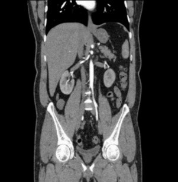
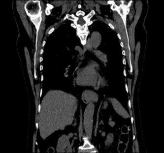
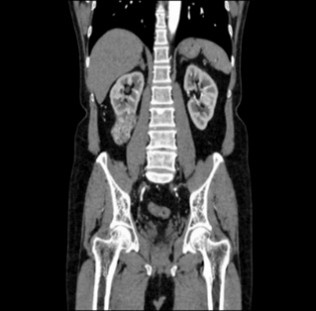
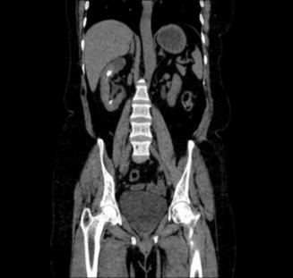

# 🧠 Enhanced Chronic Kidney Disease Detection using Hybrid GAN and SMOTE Augmentation

---

## 📖 Overview

This repository accompanies the research paper:

> **"Enhanced Chronic Kidney Disease Detection Using Auxiliary Classifier GANs and Hybrid Data Augmentation on CT Imaging"**  
> *Randhawa, P., Saxena, C., Kumar, G., Sharma, R., & Naik, N., 2025.*

The project presents a **hybrid augmentation framework** combining **SMOTE (Synthetic Minority Oversampling Technique)** and **ACGAN (Auxiliary Classifier Generative Adversarial Network)** to balance CT scan datasets for **chronic kidney disease (CKD)** detection.  
We use transfer learning models (**VGG16**, **MobileNetV2**, **EfficientNetV2**) to classify kidney images as *Normal, Cyst, Tumor,* or *Stone*.

---

## 🧬 Dataset

We used the publicly available **CT KIDNEY DATASET: Normal-Cyst-Tumor and Stone** from Kaggle:  
🔗 [https://www.kaggle.com/datasets/nazmul0087/ct-kidney-dataset-normal-cyst-tumor-and-stone](https://www.kaggle.com/datasets/nazmul0087/ct-kidney-dataset-normal-cyst-tumor-and-stone)

| Category | Sample Image |
|-----------|--------------|
| **Normal Kidney** |  |
| **Cyst** |  |
| **Tumor** |  |
| **Stone** |  |

> *All patient information has been anonymized; images are provided for educational and research purposes only.*

---

## 🧠 Methodology

Our approach combines **SMOTE** and **ACGAN** for hybrid data augmentation.

1. **SMOTE (Synthetic Minority Oversampling Technique)**  
   - Generates new feature-space samples for underrepresented classes.  
   - Improves class balance without duplicating data.

2. **ACGAN (Auxiliary Classifier GAN)**  
   - Generates **label-conditioned** CT images with improved anatomical fidelity.  
   - Enhances model generalization across kidney states.

3. **Classification Models**
   - **VGG16**, **EfficientNetV2**, and **MobileNetV2** were fine-tuned.
   - Compared across original and augmented datasets.

---

## 📊 Results Summary

| Model | Original Dataset Accuracy | Synthesized Dataset Accuracy | Training Duration |
|:------|:--------------------------:|:-----------------------------:|:-----------------:|
| **VGG16** | 99.2% | 97.3% | ~150 min |
| **EfficientNetV2** | 97.6% | 97.0% | ~455 min |
| **MobileNetV2** | 97.2% | 95.1% | ~111 min |

> Hybrid augmentation improved model robustness and reduced overfitting, producing clinically relevant accuracy scores.

---

👥 Authors
Princy Randhawa – Dayananda Sagar University

Chitransh Saxena – Manipal University Jaipur

Gireesh Kumar (Corresponding Author) – Manipal University Jaipur

Richa Sharma – JK Lakshmipat University Jaipur

Nithesh Naik – Manipal Institute of Technology

📩 Contact: gireesh.kumar@jaipur.manipal.edu

📬 For Queries or Collaboration
Feel free to open an issue or reach out at gireesh.kumar@jaipur.manipal.edu
